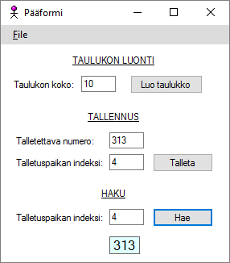

# 07_Array (Taulukko) 

Kirjoita Windows Forms -ohjema, jonka formissa on toiminnot taulukon luontia, talletusta ja hakua varten (Kuva 1-1).  




Kuva 1-1. Pääformi 

2. Kirjoita ensin taulukon luontitoiminto (Kuvan 1-1 TAULUKON LUONTI). Taulukon koko kenttään syötetään taulukon muistipaikkojen lukumäärä. Kun 'Luo taulukko'-nappia klikataan, niin napin tapahtumankäsittelijässä luodaan taulukko. 

    1. Testaa ohjelman toimivuus tässä vaiheessa debuggerin avulla ennen, kuin jatkat eteenpäin. 

    2. Lisää halutut muuttujat watch -listaan. Siirry askel kerrallaan eteenpäin F11 –nappia painamalla. 

 
3. Lisää formiin tallennustoiminto. Talletettava numero syötetään 'Talletettava numero'-kenttään ja talletuspaikan indeksi kirjoitetaan 'Talletuspaikan indeksi'-kenttään. Huomaa, että taulukon ensimmäisen paikan indeksi on 0 toisen 1 ja kolmannen 2 jne. Kun 'Talleta'-nappia klikataan, niin talletetava numero talletetaan edellä luotuun taulukkoon talletuspaikan indeksin osoittamaan paikkaan. 

    1. Testaa ohjelman toimivuus tässä vaiheessa saamaan tapaan, kuin kohdassa 2.1. 

*Huom!* Muuttujat ovat olemassa vain siinä lohkossa missä ne on määritelty. {} rajaama alue. Jos luomasi taulukko ei ole olemassa kun yrität sijoittaa siihen numeroita, ongelma voi olla siinä. Taulun osoitin voidaan luoda erikseen ja sen koko määritellä erikseen jolloin vasta varataan myös tilaa muistista.  

```c#
int[] taulukko;  


taulukko = new int[5]; 
```

Luo siis taulukkosi lomakkeen kattavaksi ja määritä koko vasta kun käyttäjä on antanut tarvittavat tiedot. 

4. Lisää formiin hakutoiminto. Kun haettavan numeron talletuspaikan indeksi syötetään 'Talletuspaikan indeksi'-kenttään ja klikataan 'Hae'-nappia, niin taulukosta haetaan indeksin mukaisesta talletuspaikasta numero ja tulostetaan se formissa olevaan Label-komponenttiin. 

 
5. Entä jos käyttäjä syöttää liian suuren indeksi numeron tai kirjaimen? Lisää virheen tarkistus hyödyntämällä try-catch rakennetta. 

  

 
