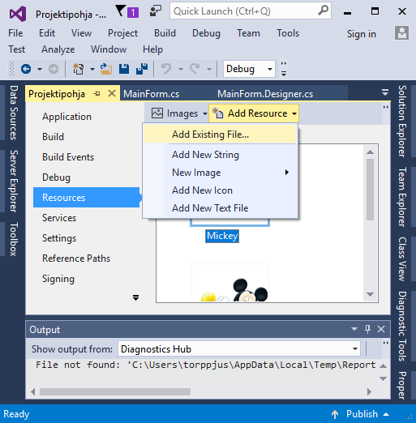
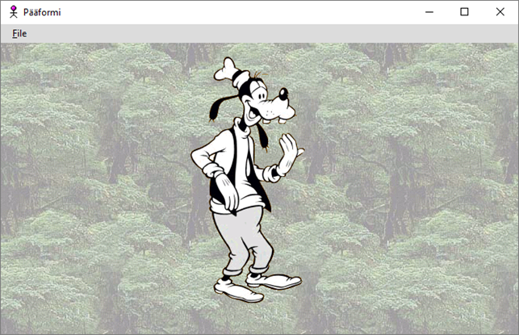
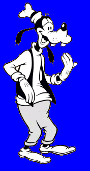
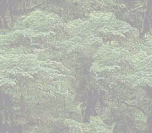

# 13_Picture

Kirjoita Windows Forms -ohjelma, jonka formissa on taustakuva (Viidakko.png). Taustakuvan päällä voidaan hiirellä liikuttaa bittikarttakuvaa (HessuHopo.png). 

a) Lisää formiin taustakuva formin BackgroundImage-ominaisuuden avulla.  

Lisää Hessun kuva projektin resursseihin seuraavasti: 

 
Tämän jälkeen kuvaan voidaan viitata koodissa Properties.Recourses.kuvannimi. 

 
Kuvaa varten täytyy luoda lomakkeen laajuinen Bitmap tyyppinen muuttuja (olio muuttuja). Bitmap -luokka sijaitsee System.Drawing nimiavaruudessa. 

  

b) Lisää formin Paint-eventtiin tapahtumankäsittelijä (Ns. Paint()-metodi) ja kirjoita siihen ohjelmakoodit kuvan tulostamiseksi formiin hiiren klikkauskohtaan (Hiiren klikkauskohta talletetaan Point-tyyppiseen tietorakenteeseen.). Tulosta kuva siten, että sen tausta on läpinäkyvä. Vinkki! Etsi Bitmap methods. 

  

c) Lisää formin MouseDown ja MouseMove eventeihin tapahtumankäsittelijät. Kumpaankin tapahtumankäsittelijään tulee sama ohjelmakoodi. Kun hiiren vasemmanpuoleinen nappi on alas painettuna, niin silloin luetaan hiiren klikkauskohdan koordinaatit (x ja y) Point-tyyppiseen tietorakenteeseen ja Invalidate()-metodilla aiheutetaan Paint()-metodin kutsu eli formin uudelleen piirto. 

  Järjestelmän luoma vaihtoehtoinen teksti:

Kuva 13-1. Pääformi 

2. Tässä vaiheessa Hessu Hopoa liikuteltaessa formi välkkyy häiritsevästi. Miten voit korjata kyseisen vaivan ? 

                  => Poista vilkkuminen! 

                  https://docs.microsoft.com/en-us/dotnet/desktop/winforms/advanced/double-buffered-graphics?view=netframeworkdesktop-4.8

